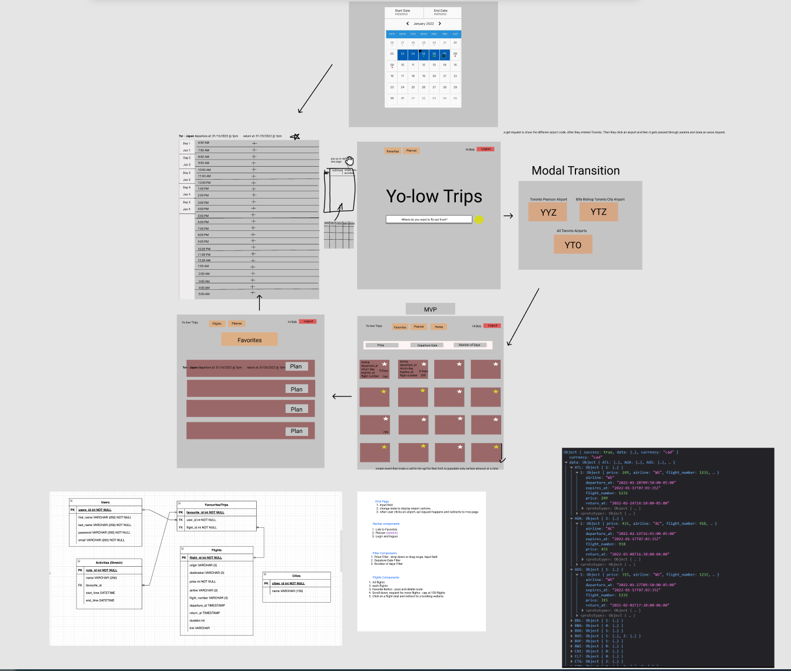

# Yo-Low-Trips


# About
This project is a full stack web application where users can input an origin city and get one way flight deals to multiple destination. New flight deals are updated everyday. This web application are for those who are looking for a flight deal and are flexible with date and destination.


# Project Planning
Project planning from idea to design. ERD and a response of the flight data API

https://www.figma.com/file/xIsjaQgt5A9zEaCCqdme5p/Final-Project?node-id=0%3A1



# How to run locally instructions

# `Database`
To startup PostgreSQL sever type ```startpostgres```
Password for labber = ```labber```

# `Backend`
1. cd backend
2. npm install - to install dependencies
3. npm start

# `Frontend`
1. cd frontend
2. npm install - to install dependencies
3. npm start


# Dependencies

1. Axios
2. React
3. React-Dom
4. React-Router-Dom
5. MUI
6. Moment

# RoadMap

1. Build a travel planner - A calendar modal will appear where user can select a date range. The range of days will appear on the side on a new page and users can input activities on an hourly base.